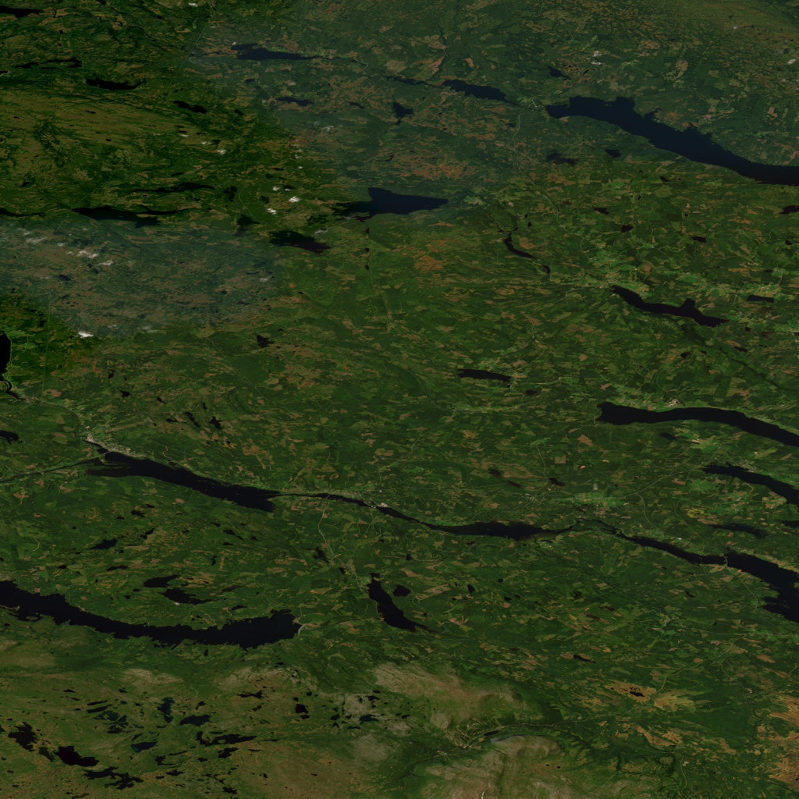
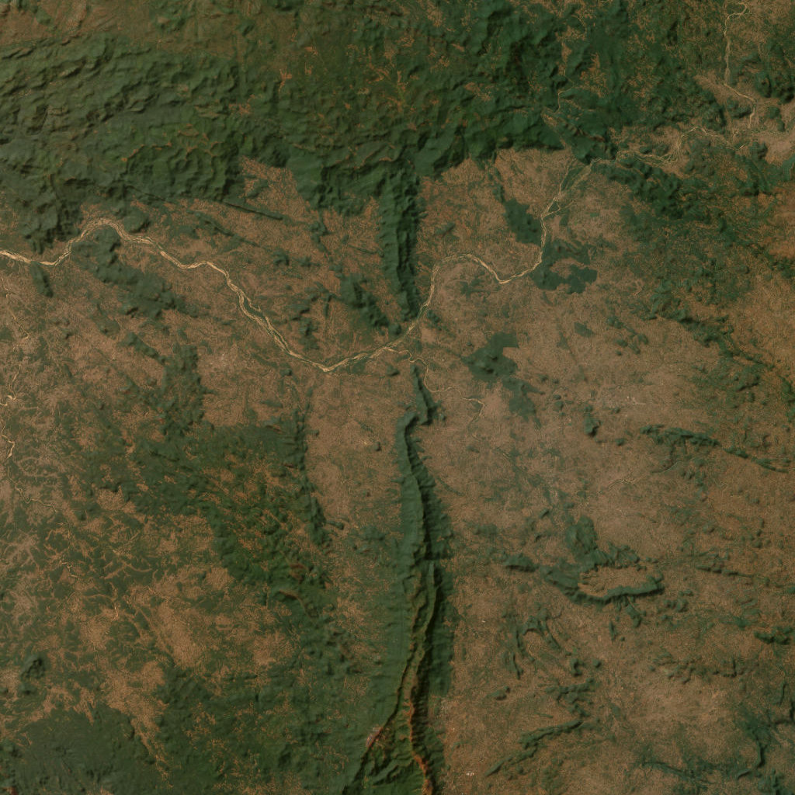
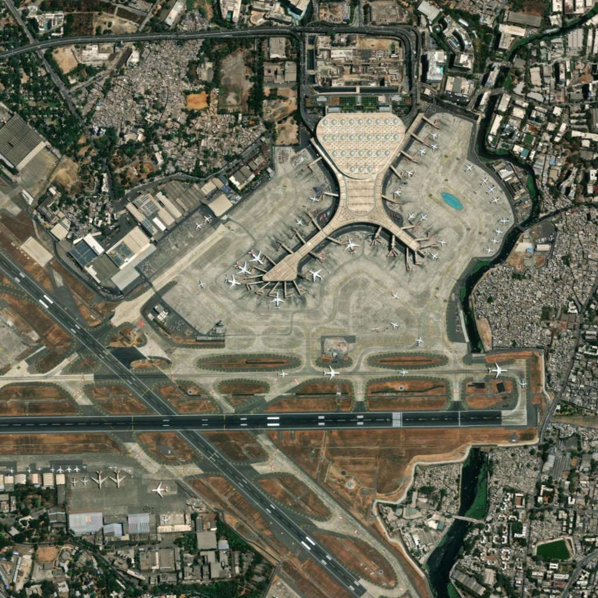

# Project Okavango — Group B

A lightweight Python application for visualising global environmental indicators on an interactive world map. Built as part of the **Advanced Programming** course at Nova SBE.

The tool automatically fetches the **most recent** environmental datasets from [Our World in Data](https://ourworldindata.org/), merges them with country geometries using GeoPandas, and presents the results through an interactive Streamlit dashboard powered by Plotly. A second page performs AI-powered environmental risk analysis of satellite imagery using a local [Ollama](https://ollama.com/) instance.

**Live Application:** [groupb-qtqrrbbvcdclxdhjzqcrtg.streamlit.app](https://groupb-qtqrrbbvcdclxdhjzqcrtg.streamlit.app/)

## Team

| Name                | Email                   |
|---------------------|-------------------------|
| Michael Kania       | 72782@novasbe.pt        |
| Leon Schmidt        | 71644@novasbe.pt        |
| Matteo De Francesco | 71734@novasbe.pt        |
| Vanessa Weiss       | 73217@novasbe.pt        |

---

## Datasets

All data is downloaded automatically at runtime — nothing is hardcoded.

| # | Dataset | Source |
|---|---------|--------|
| 1 | Annual Change in Forest Area | [ourworldindata.org/deforestation](https://ourworldindata.org/deforestation) |
| 2 | Annual Deforestation | [ourworldindata.org/deforestation](https://ourworldindata.org/deforestation) |
| 3 | Share of Protected Land | [ourworldindata.org/sdgs/life-on-land](https://ourworldindata.org/sdgs/life-on-land) |
| 4 | Share of Degraded Land | [ourworldindata.org/sdgs/life-on-land](https://ourworldindata.org/sdgs/life-on-land) |
| 5 | Share of Marine Protected Areas | [ourworldindata.org/sdgs/life-below-water](https://ourworldindata.org/sdgs/life-below-water) |
| Map | Natural Earth 110 m Admin 0 Countries | [naturalearthdata.com](https://www.naturalearthdata.com/downloads/110m-cultural-vectors/) |

---

## Project Structure

```
Group_B/
├── app/
│   ├── __init__.py
│   ├── data.py            # OwidData class — data download, preprocessing, merging
│   ├── ai_pipeline.py     # AI/satellite pipeline — image retrieval, description & risk classification
│   └── database.py        # SQLite persistence layer — insert and lookup cached analyses
├── pages/
│   ├── 1_Data_Explorer.py      # Page 1 — interactive choropleth map and trend charts
│   └── 2_Satellite_Analysis.py # Page 2 — satellite imagery + AI analysis UI
├── database/
│   └── okavango.db        # SQLite database (auto-created; stores analysis results)
├── downloads/              # Auto-generated folder for fetched datasets & shapefiles
├── images/                 # Auto-generated folder for cached satellite images
├── notebooks/              # Jupyter notebooks for exploratory analysis
├── tests/                  # Unit tests (pytest)
├── models.yaml             # AI model and prompt configuration
├── main.py                 # Streamlit multi-page navigation entry point
├── requirements.txt        # pip dependencies
├── setup.cfg               # Linter configuration (flake8)
├── .gitignore
├── LICENSE
└── README.md
```

---

## Setup Instructions

### Prerequisites

- Python ≥ 3.11
- [Ollama](https://ollama.com/)

### 1. Clone the Repository

```bash
git clone https://github.com/mchlkan/Group_B.git
cd Group_B
```

### 2. Create a Virtual Environment and Install Dependencies

```bash
python3 -m venv .venv
source .venv/bin/activate        # macOS / Linux
# .venv\Scripts\activate         # Windows
pip install -r requirements.txt
```

### 3. Install and Start Ollama

Ollama is required to run the AI satellite analysis features. Install it from [ollama.com/download](https://ollama.com/download) or via a package manager:

```bash
# macOS
brew install ollama

# Linux
curl -fsSL https://ollama.com/install.sh | sh
```

Then start the Ollama server:

```bash
ollama serve
```

> **Note:** The app automatically downloads the required AI models (`qwen3.5:2b` and `qwen3.5:4b`) on first use, no manual `ollama pull` is needed. Model names and prompts are configured in `models.yaml`.
>
> The Data Explorer page works without Ollama. Only the Satellite Analysis page requires it.

### 4. Run the Application

```bash
streamlit run main.py
```

The dashboard opens in your browser at <http://localhost:8501>. On first run, all datasets and shapefiles are automatically downloaded into `downloads/`. This might take a few seconds.

### 5. Run Tests

The test suite lives in `tests/` and is split into two files with different requirements:

| File | What it tests | Needs internet | Needs Ollama |
|------|--------------|---------------|-------------|
| `test_datasets.py` | `OwidData` download & merge pipeline | Yes (first run only) | No |
| `test_ai_pipeline.py` | Pure AI pipeline helpers (parsing, filename, tile math, config loading) | No | No |

**Run all tests:**

```bash
python3 -m pytest tests/ -v
```

**Run a single test file:**

```bash
# data pipeline tests only (requires internet on first run)
python3 -m pytest tests/test_datasets.py -v

# AI pipeline unit tests only (fully offline)
python3 -m pytest tests/test_ai_pipeline.py -v
```

**Run with coverage report:**

```bash
python3 -m pytest tests/ -v --cov=app --cov-report=term-missing
```

**Run a specific test class or function:**

```bash
# run only the risk-response parsing tests
python3 -m pytest tests/test_ai_pipeline.py::TestParseRiskResponse -v

# run a single test by name
python3 -m pytest tests/test_ai_pipeline.py::TestParseRiskResponse::test_well_formed -v
```

> **Note:** `test_datasets.py` triggers a full `OwidData()` instantiation, which downloads all five OWID CSVs and the Natural Earth shapefile into `downloads/` on first run. Subsequent runs skip the download and complete quickly. All tests in `test_ai_pipeline.py` are pure unit tests and run offline without Ollama.

---

## How It Works

### Data layer — `app/data.py`

The `OwidData` class drives the entire data pipeline:

1. Downloads the five OWID CSV datasets and the Natural Earth 110 m shapefile into `downloads/` (skipped if already present).
2. Preprocesses each dataset: validates columns, auto-detects the metric column, and adds `is_aggregate` / `is_mappable` boolean flags.
3. Merges all datasets with country geometries via GeoPandas to produce a single `GeoDataFrame` per dataset ready for mapping.

### AI pipeline — `app/ai_pipeline.py`

Implements satellite image retrieval and AI-powered environmental risk analysis using a local [Ollama](https://ollama.com/) instance:

1. **Image retrieval** — `fetch_satellite_image(lat, lon, zoom)` downloads high-resolution tiles from ArcGIS World Imagery (with automatic fallback across multiple tile endpoints) and caches them in `images/`.
2. **Image description** — `analyze_image(image_path)` sends the satellite image to a multimodal Ollama model (default: `qwen3.5:2b`) which generates a natural-language description of land cover, vegetation health, and signs of environmental degradation.
3. **Risk classification** — `classify_risk(description)` passes the description to a text model (default: `qwen3.5:4b`) which returns a structured danger level (1–5), label, and reason.
4. **Persistence** — `save_analysis(...)` / `load_previous_analysis(...)` store and retrieve results from the SQLite database. If a result already exists for the same coordinates and zoom level, it is returned immediately without calling Ollama again.

Model names, prompts, and generation options can be customised via `models.yaml`.

### Application — `main.py` + `pages/`

`main.py` is the Streamlit multi-page navigation hub. It registers two pages and delegates rendering to each:

**Page 1 — Data Explorer** (`pages/1_Data_Explorer.py`)
- `load_data()` — loads and caches the `OwidData` instance.
- `_render_kpis()` — displays key indicators (countries with data, global mean, highest, lowest).
- `_render_bar_chart()` — top-5 / bottom-5 countries bar chart; click a bar to select a country.
- `_render_details_and_trend()` — per-country metric cards and a time-series line chart.
- `page()` — assembles the full layout: sidebar controls (dataset, year, region), choropleth map, and the panels above.

**Page 2 — Satellite Analysis** (`pages/2_Satellite_Analysis.py`)
- `page()` — interactive map for coordinate selection, triggers satellite image download and AI analysis via `app.ai_pipeline`.
- `_download_model()` — handles Ollama model download with a Streamlit progress UI (auto-triggered on first use).
- `_danger_badge()` — renders a colour-coded HTML badge for the AI danger level.
- `_render_placeholder()` — shown when no satellite image is available.
- `_render_result()` — displays the satellite image, AI description, and risk assessment (level, label, reason).

---

## Configuration — `models.yaml`

All AI model configuration lives in `models.yaml` at the project root. Both top-level keys are required, removing either will break the AI pipeline.

```yaml
image_description:       # required — drives the satellite image description step
  model: qwen3.5:2b      # Ollama model identifier
  display_name: ...      # human-readable label shown in the UI
  prompt: >              # instruction sent to the model
    Describe this satellite image...
  options:
    temperature: 0.2     # sampling temperature (lower = more deterministic)
    top_p: 0.9           # nucleus sampling threshold
    num_predict: 256     # max tokens to generate

risk_classification:     # required — drives the danger level classification step
  model: qwen3.5:4b
  display_name: ...
  prompt: >
    You are an environmental risk analyst...
  options:
    temperature: 0.1
    top_p: 0.9
    num_predict: 120
```

### Key reference

| Key | Type | Description |
|-----|------|-------------|
| `model` | string | Ollama model identifier (e.g. `qwen3.5:2b`). Must be available via `ollama list` or will be auto-pulled. |
| `display_name` | string | Human-readable name shown in the UI. |
| `prompt` | string | System / user prompt sent to the model. |
| `options.temperature` | float | Sampling temperature. Lower values produce more consistent outputs. |
| `options.top_p` | float | Nucleus sampling threshold. |
| `options.num_predict` | int | Maximum number of tokens the model will generate. |

To use a different model, replace the `model` value with any Ollama-compatible identifier (e.g. `llava:7b`, `llama3.2-vision:11b`). The app will pull it automatically on first use.

---

## Database & Caching

Analysis results are persisted in a local SQLite database at `database/okavango.db`. The database and table are created automatically on first run.

### Table schema — `analyses`

| Column | Type | Description |
|--------|------|-------------|
| `id` | INTEGER | Auto-incrementing primary key |
| `timestamp` | TEXT | UTC timestamp of the analysis (ISO 8601) |
| `latitude` | REAL | Latitude of the analysed location |
| `longitude` | REAL | Longitude of the analysed location |
| `zoom` | INTEGER | Map zoom level used for the satellite tile |
| `image_path` | TEXT | Path to the cached satellite image in `images/` |
| `image_description` | TEXT | Raw AI description of the satellite image |
| `image_prompt` | TEXT | Prompt used for the image description model |
| `image_model` | TEXT | Model identifier used for image description |
| `text_description` | TEXT | Full text passed to the risk classifier |
| `text_prompt` | TEXT | Prompt used for the risk classification model |
| `text_model` | TEXT | Model identifier used for risk classification |
| `danger_level` | INTEGER | Risk score from 1 (Very Low) to 5 (Critical) |
| `danger_label` | TEXT | Human-readable risk label |
| `danger_reason` | TEXT | One-sentence explanation of the risk score |

### Caching behaviour

Before calling Ollama, the app queries the database for an existing record matching `(latitude, longitude, zoom)`. If a match is found, the cached result is returned immediately — no model inference occurs. This makes repeated lookups of the same location instant.

To force a fresh analysis, either change the zoom level or delete the relevant row directly from the database:

```bash
# open the database
sqlite3 database/okavango.db

# delete a specific cached result
DELETE FROM analyses WHERE latitude = -3.4653 AND longitude = -62.2159 AND zoom = 12;
```

---

## Examples — Dangerous Area Detections

The following examples illustrate the output format of the Satellite Analysis page across different risk levels. Results were generated by local Ollama models, the output may vary slightly depending on the model version.

---

### Example 1 — Very Low Risk (Level 1)

**Location:** Jämtland, Sweden — 63.47°N, 13.71°E, zoom 9
**Model:** qwen3.5:0.8b (description) · qwen3.5:0.8b (classification)



> This satellite image displays a densely vegetated landscape dominated by lush green forests and agricultural fields, indicating high vegetation health and coverage. Numerous dark blue water bodies—likely lakes or reservoirs—are scattered across the terrain, suggesting abundant surface water without signs of drought or flooding. There is no visible evidence of deforestation, fire scars, erosion, or pollution; natural areas appear intact and undisturbed. The overall scene reflects a stable, ecologically rich environment with minimal anthropogenic degradation. Vegetation appears uniformly healthy, with no patches of bare soil or stressed plant life evident at this resolution.

**Risk Assessment**

| | |
|---|---|
| **Level** | 1 — Very Low |
| **Label** | Very Low |
| **Reason** | The landscape shows a healthy, undisturbed ecosystem with no visible signs of deforestation, pollution, erosion, or drought. |

---

### Example 2 — High Risk (Level 4)

**Location:** Chhattisgarh, India — 19.10°N, 80.95°E, zoom 9
**Model:** qwen3.5:0.8b (description) · qwen3.5:0.8b (classification)



> This satellite image shows a landscape with mixed land cover, including patches of dense green vegetation—likely forests or scrubland—and areas of brownish, bare soil suggesting drought or post-fire degradation. A winding river or stream cuts through the terrain, appearing relatively clear but possibly seasonal in flow. The contrast between lush green zones and dry, cracked earth indicates spatial variability in moisture availability or land use. Some regions show signs of deforestation or agricultural clearing, while others may reflect recent fire scars given their uniform brown tone and lack of canopy. Overall, the scene suggests an environment under stress from either climatic conditions (e.g., prolonged dry spell) or human activity, with no obvious signs of active flooding or pollution. Vegetation health appears patchy—thriving in some areas while severely degraded in others—pointing to localized environmental pressures rather than widespread catastrophe.

**Risk Assessment**

| | |
|---|---|
| **Level** | 4 — High |
| **Label** | High |
| **Reason** | The presence of clear deforestation, uniform fire scars, and extensive drought-stressed vegetation indicates significant environmental degradation beyond natural variability. |

---

### Example 3 — High Risk (Level 4)

**Location:** Mumbai, India — 19.08°N, 72.87°E, zoom 14
**Model:** qwen3.5:0.8b (description) · qwen3.5:0.8b (classification)



> This satellite image shows a large airport complex surrounded by dense urban development and sparse vegetation. The land cover is dominated by concrete runways, taxiways, terminal buildings, and paved aprons, with minimal natural ground cover. Vegetation appears patchy and largely absent in the built-up zones, while scattered green patches suggest limited or stressed plant life—possibly due to urban heat or poor soil conditions. A small blue water body (likely a pond or reservoir) is visible near the terminal, indicating localized water presence but no extensive wetlands or rivers. No clear signs of active deforestation, flooding, or recent fire scars are evident; however, the overall lack of vegetative cover and presence of bare or compacted soil suggest potential environmental degradation from urban expansion and infrastructure development. Natural areas appear fragmented and under pressure from surrounding construction and population density.

**Risk Assessment**

| | |
|---|---|
| **Level** | 4 — High |
| **Label** | High |
| **Reason** | The image shows severe environmental degradation caused by extensive urban expansion and infrastructure development, resulting in the complete removal of natural vegetation and replacement with concrete and paved surfaces. |

---

## Sustainability & SDG Alignment

Project Okavango directly supports three United Nations Sustainable Development Goals:

### SDG 15 — Life on Land

The project's core is built around SDG 15 indicators. Four of the five datasets which are, annual change in forest area, annual deforestation, share of protected land, and share of degraded land, directly measure progress (or regression) against SDG 15 targets on forest conservation, land degradation, and ecosystem protection. The AI satellite analysis layer extends this further by enabling real-time, location-specific monitoring that complements the country-level statistics. Together, the two tools give users both the macro picture (national trends over decades) and a micro lens (what is actually happening at a specific coordinate today).

### SDG 13 — Climate Action

Forests are among the planet's largest carbon sinks. Deforestation and land degradation release stored carbon and reduce the Earth's capacity to absorb future emissions, making them among the most powerful drivers of climate change. By visualising deforestation trends and degraded land shares across every country, the app puts this connection front and centre for policymakers, researchers, and students. The AI risk classification system flags high-danger locations in real time, supporting early intervention before ecological tipping points are crossed.

### SDG 14 — Life Below Water

Ocean health is inseparable from land use. The fifth dataset, share of marine protected areas, tracks coastal and ocean conservation directly. Beyond this, terrestrial deforestation drives sediment runoff and nutrient pollution into rivers and coastal zones, degrading coral reefs, seagrass beds, and fisheries. By surfacing both marine protection data and land degradation indicators in a single tool, the app helps users understand the land–sea feedback loop that SDG 14 depends on. Protecting forests upstream is as important to ocean health as managing marine areas directly.

---

## Requirements

- Python ≥ 3.11
- [Ollama](https://ollama.com/) installed and running (`ollama serve`) for satellite AI analysis
- See [requirements.txt](requirements.txt) for package versions:
  - `geopandas >=1.0, <2.0`
  - `pandas >=2.0, <3.0`
  - `plotly >=5.0, <6.0`
  - `streamlit >=1.35, <2.0`
  - `PyYAML >=6.0`
  - `Pillow`

---

## License

This project is licensed under the [MIT License](LICENSE).
